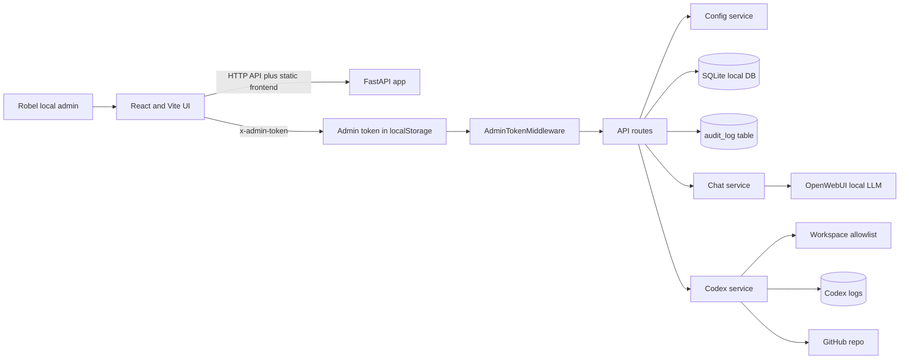
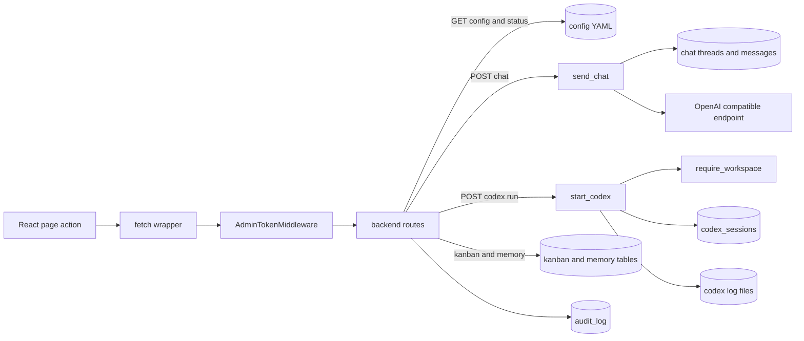
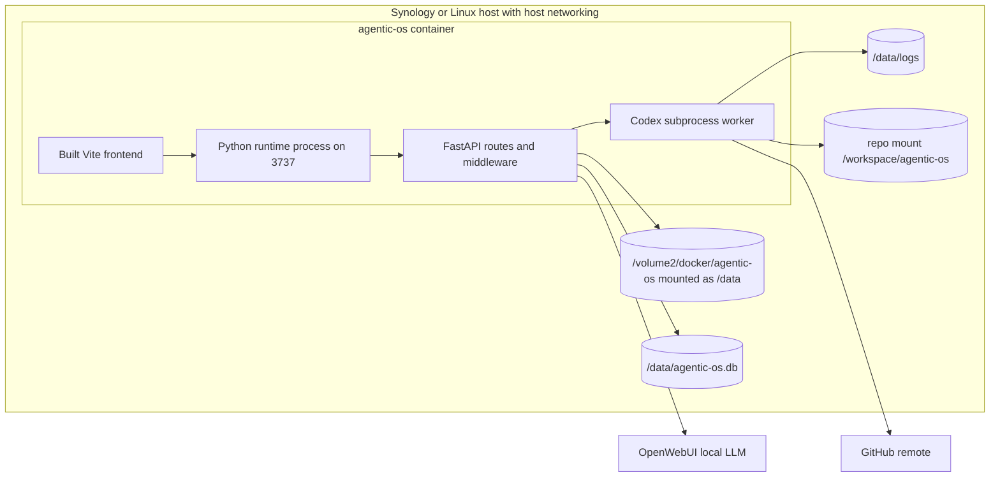
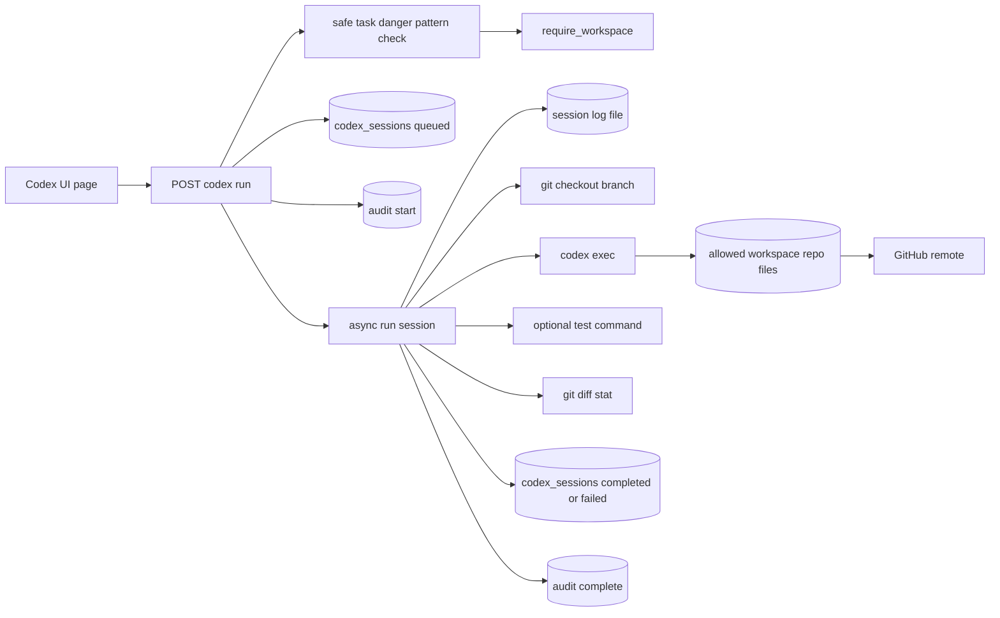

# Architecture

Agentic OS is Robel's local-first AI operations control plane: **one process, every door**. It unifies local agent status, chat history, Codex sessions, workspaces, Kanban, memory, skills, settings, and audit logs in a single FastAPI + React container.

The MVP is intentionally one container: FastAPI serves `/api` and the built Vite frontend. SQLite stores local state in `/data/agentic-os.db`. YAML files under `config` define agents, providers, workspaces, and skills. No Redis, Postgres, Kubernetes, Supabase, or microservices are required for MVP.

## Diagram index

| View | Draw.io | Explanation |
| --- | --- | --- |
| System context | [system-context.drawio](diagrams/system-context.drawio) | [system-context.md](diagrams/system-context.md) |
| Data flow | [data-flow.drawio](diagrams/data-flow.drawio) | [data-flow.md](diagrams/data-flow.md) |
| Runtime deployment | [runtime-deployment.drawio](diagrams/runtime-deployment.drawio) | [runtime-deployment.md](diagrams/runtime-deployment.md) |
| Agent tool execution | [agent-tool-execution.drawio](diagrams/agent-tool-execution.drawio) | [agent-tool-execution.md](diagrams/agent-tool-execution.md) |

## Runtime modules

- `core`: settings, logging, token middleware, redaction.
- `db`: SQLite connection and idempotent migrations.
- `services`: config, audit, chat, Codex, workspace logic.
- `adapters`: provider-specific clients such as OpenAI-compatible chat.
- `api`: route definitions.

## System context

## Data flow

## Runtime deployment

## Agent tool execution

## Auth and security model

- `AGENTIC_OS_ADMIN_TOKEN` is required in production.
- The browser stores the token in localStorage and sends it as `x-admin-token` for protected actions.
- `AdminTokenMiddleware` protects mutating HTTP methods and log or session read endpoints.
- `codex_service._safe_task` refuses known-dangerous task patterns.
- `workspace_service.require_workspace` restricts Codex execution to configured workspaces.
- Audit records are written for chat, Codex, Kanban, memory, and cancellation actions.
- Secrets are redacted by the security helper when values match token, secret, key, password, or credential patterns.

## Storage model

- SQLite: `/data/agentic-os.db` with WAL mode and foreign keys enabled.
- Logs: `/data/logs`, including Codex session logs.
- Config: YAML files under `config`.
- Workspace mount: compose maps the repo into `/workspace/agentic-os`.

## Deployment model

- Dockerfile builds the Vite frontend with Node 22, then copies static assets into the Python 3.12 runtime image.
- Runtime starts the Python process on port 3737 unless overridden by `AGENTIC_OS_APP_PORT`.
- `docker-compose.yml` uses host networking, container name `agentic-os`, `/volume2/docker/agentic-os:/data`, and current directory mounted as `/workspace/agentic-os`.

## Failure modes and troubleshooting

- **503 on startup:** production mode without `AGENTIC_OS_ADMIN_TOKEN`; set the token in `.env`.
- **401 on actions or log reads:** missing or incorrect `x-admin-token`; update the UI token box.
- **Chat fails:** check provider YAML, `AGENTIC_OS_OPENWEBUI_URL`, model name, and OpenWebUI reachability.
- **Codex run fails immediately:** check workspace name and path, dangerous-pattern rejection, or missing `codex` CLI in the runtime.
- **Codex run hangs or fails later:** inspect `/data/logs/codex`, `codex_sessions`, and audit entries.
- **State missing after restart:** check `/volume2/docker/agentic-os:/data` mount and file permissions.

## Rollback path

- Stop the container: `docker compose down`.
- Restore previous image or Git commit.
- Restore `/volume2/docker/agentic-os` from backup if state rollback is required.
- Re-run `docker compose up -d --build` after restoring code and config.
