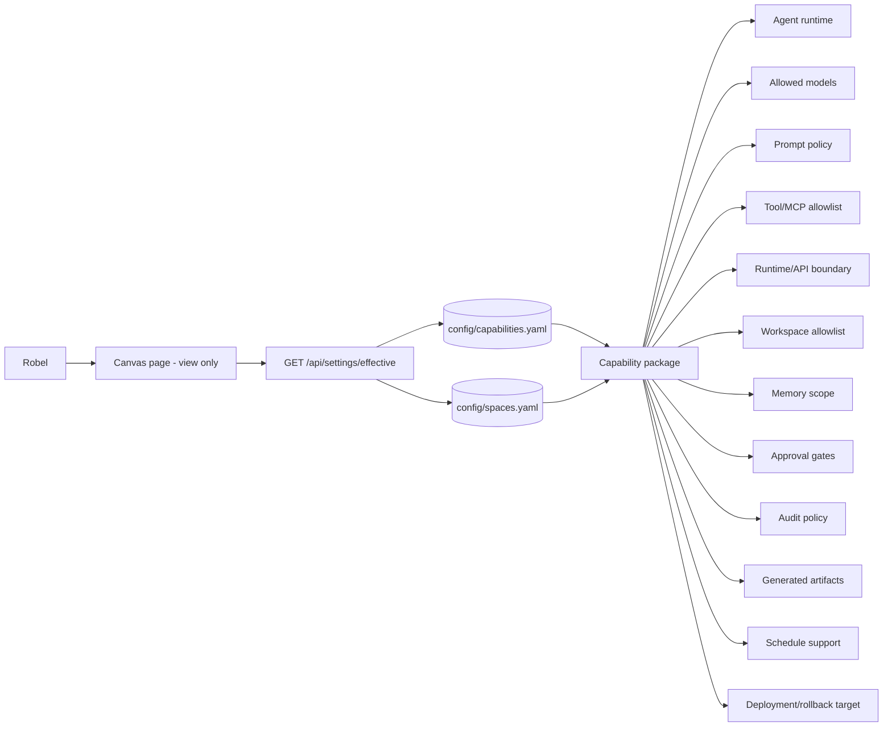

# Capability Canvas Diagram

```mermaid
flowchart LR
  Robel[Robel] --> Canvas[Canvas page - view only]
  Canvas --> Settings[GET /api/settings/effective]
  Settings --> Capabilities[(config/capabilities.yaml)]
  Settings --> Spaces[(config/spaces.yaml)]
  Capabilities --> Capability[Capability package]
  Spaces --> Capability
  Capability --> Agent[Agent runtime]
  Capability --> Model[Allowed models]
  Capability --> Prompt[Prompt policy]
  Capability --> Tool[Tool/MCP allowlist]
  Capability --> API[Runtime/API boundary]
  Capability --> Workspace[Workspace allowlist]
  Capability --> Memory[Memory scope]
  Capability --> Approval[Approval gates]
  Capability --> Audit[Audit policy]
  Capability --> Artifact[Generated artifacts]
  Capability --> Schedule[Schedule support]
  Capability --> Deploy[Deployment/rollback target]
```

The Canvas page renders a graph derived from local YAML files. The MVP is read-only: it does not edit YAML, start runtimes, bypass approval gates, or execute commands.
