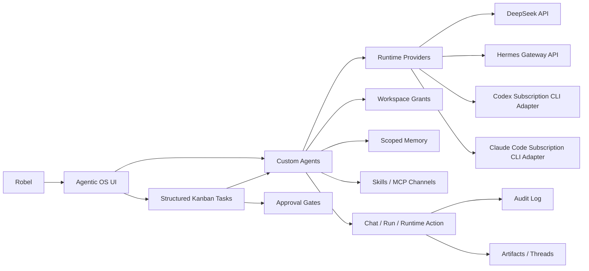

# Core operating studio diagram

## Explanation

Agentic OS is the control plane. Agents are configured identities that attach a provider/model strategy, workspace access, memory scopes, skills/MCP channels, and approval policy. Kanban tasks are structured work orders that assign work to agents and link to workspaces, schedules, approval gates, artifacts, and audit events.

Hermes dashboard access is intentionally separate from Hermes gateway/API access. The dashboard is human UI; the gateway/API is the action path Agentic OS needs.
