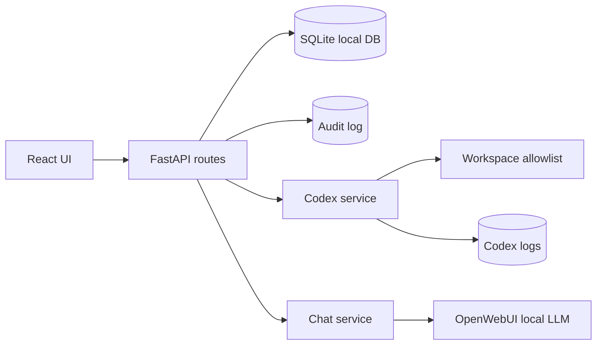

# Agentic OS System Context

Draw.io file: [`system-context.drawio`](system-context.drawio)

## Mermaid

## Explanation

This diagram documents the actual Agentic OS MVP implementation in this repository: React and Vite frontend, FastAPI backend, SQLite state, YAML configuration, admin-token middleware, chat service, Codex subprocess sessions, workspace allowlisting, logs, and audit records.

## Auth, storage, logs, and failure points

- Auth happens in `AdminTokenMiddleware` using `AGENTIC_OS_ADMIN_TOKEN` and the browser-provided `x-admin-token` header.
- Data is stored in SQLite at `/data/agentic-os.db`; Codex logs are stored under `/data/logs/codex`.
- Audit entries are written through `audit_service.record` for meaningful user and agent actions.
- Failures normally appear as HTTP errors in the UI, audit rows, or Codex session log files.
