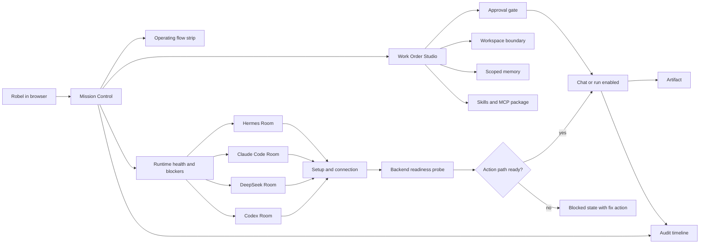

# UI operating cockpit diagram

## Explanation

Mission Control is the front door. Agent rooms are the control surfaces. Workspaces, memory, skills/MCP, approvals, runs, artifacts, and audit are connected through structured work orders. The UI must never imply a runtime is ready until the backend probe confirms a real action path.
