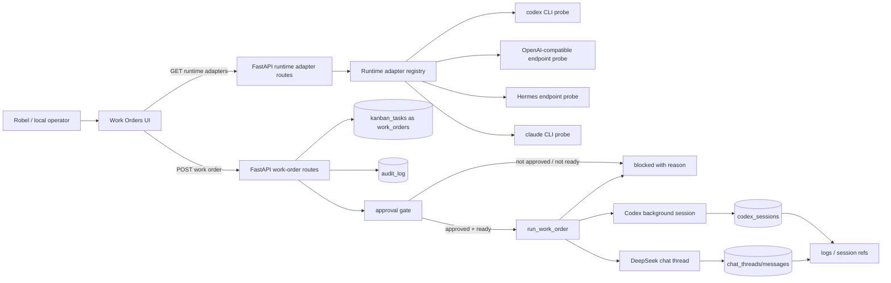

# Work Order Runtime Path

Draw.io file: [`work-order-runtime.drawio`](work-order-runtime.drawio)

## Mermaid

## What is real in this implementation

- The Work Orders page creates records through the backend, not local-only state.
- Runtime readiness is probed by the backend adapter registry and shown in the UI.
- Create, approve, run, blocked-run, and update actions write audit records.
- Codex work orders start a real background Codex session when the `codex` CLI and workspace are available.
- DeepSeek work orders call the existing chat service and link the resulting thread.
- Hermes, Claude, and MCP registry entries are shown honestly as blocked/not implemented unless their executable or endpoint is available.

## Safety properties

- Work orders do not auto-run when created.
- Run requires `approval_state=approved`.
- Codex run still goes through workspace allowlisting and the existing Codex danger-pattern checks.
- If a runtime is not ready, the backend blocks the run and writes an audit event with the reason.
- The UI disables run buttons until both approval and runtime readiness are true.

## Main failure modes

| Failure | Expected behavior |
| --- | --- |
| Missing Codex CLI | Runtime adapter reports blocked; run returns HTTP 400 and audit event. |
| Missing DeepSeek/OpenWebUI endpoint | Adapter reports blocked with endpoint/config reason. |
| Work order not approved | Run is blocked and audit event records approval requirement. |
| Unsupported adapter path | Run is blocked rather than pretending execution happened. |
| Workspace mismatch | Codex path blocks through workspace allowlist validation. |
